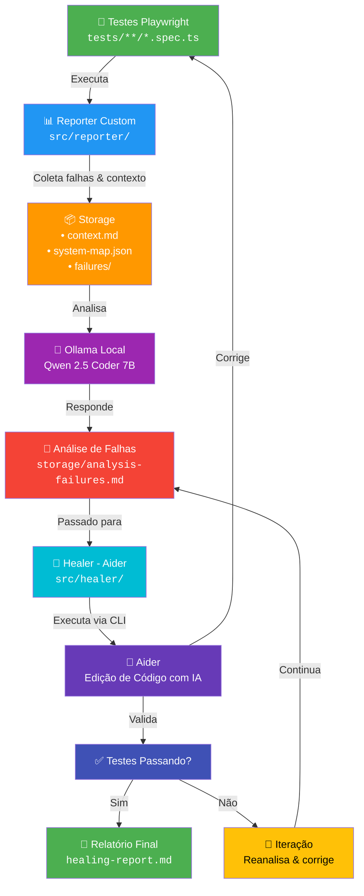

# Arquitetura - Play Intelligence

## Diagrama do Fluxo Completo



## Componentes Principais

### 1. **Reporter** (`src/reporter/`)
Intercepta execução do Playwright e coleta dados:
- **collector.ts**: Captura screenshots, stack traces, estado da página
- **mapper.ts**: Mapeia rotas acessadas, assertions, cobertura
- **index.ts**: Integra com Playwright via reporter custom

### 2. **Analyzer** (`src/analyzer/`)
Análise inteligente com IA local:
- **ai-client.ts**: Suporta Ollama, Anthropic, OpenAI
- **prompts.ts**: Prompts estruturados para análise técnica

### 3. **Healer** (`src/healer/`)
Correção automática de testes com Aider:
- **aider-client.ts**: Cliente CLI para executar o Aider como processo filho
- **index.ts**: Orquestração do processo completo
- **prompts.ts**: Instruções para o agente corrigir

### 4. **Storage** (`storage/`)
Persiste dados entre execuções:
- `context.md` - Relatório de falhas coletadas
- `system-map.json` - Mapa de rotas e cobertura
- `analysis-failures.md` - Análise de padrões (gerado)
- `healing-report-*.md` - Relatórios de correção (gerado)

---

## Fluxo de Uso

### Phase 1️⃣: Execução & Coleta
```bash
npm run test
# ↓ Reporter coleta dados automaticamente
# ↓ Salva em storage/ (ignorado pelo git)
```

### Phase 2️⃣: Análise
```bash
npm run ai:analyze
# ↓ Ollama analisa padrões
# ↓ Identifica root cause
# ↓ Salva em analysis-failures.md
```

### Phase 3️⃣: Correção Automática
```bash
npm run ai:heal
# ↓ Healer lê analysis-failures.md
# ↓ Identifica arquivos de teste
# ↓ Executa Aider com instrução de correção
# ↓ Aider edita os arquivos automaticamente
# ↓ Valida correções
# ↓ Salva relatório
```

---

## Arquitetura de Camadas

```
┌─────────────────────────────────────────────┐
│  📝 CLI Interface                           │
│  npm run test/analyze/heal/suggest/fragility │
└──────────────┬──────────────────────────────┘
               │
┌──────────────▼──────────────────────────────┐
│  🧠 Orquestrador (cli.ts)                    │
│  • Valida config                             │
│  • Rota comandos                             │
│  • Trata erros                               │
└──────────────┬──────────────────────────────┘
               │
     ┌─────────┼─────────┬──────────┐
     │         │         │          │
┌────▼──┐ ┌───▼──┐ ┌───▼──┐  ┌───▼────┐
│Report │ │Analyz│ │Healer│  │Health  │
│er     │ │er    │ │      │  │Check   │
└────┬──┘ └───┬──┘ └───┬──┘  └────────┘
     │        │        │
┌────▼────────▼────────▼──────────────┐
│  💾 Storage Layer (file system)     │
│  • context.md                        │
│  • system-map.json                   │
│  • analysis-failures.md              │
│  • healing-report.md                 │
└────┬───────────────────────────────┘
     │
┌────▼────────────────────────────────┐
│  🤖 AI Layer                        │
│  • Ollama (Local LLM - Docker)      │
│  • Aider (CLI - Edição de código)   │
└─────────────────────────────────────┘
```

---

## Docker Compose

```yaml
services:
  ollama:
    # Modelo local: Qwen 2.5 Coder 7B
    # Porta: 11434
    # Uso: Análise & insights + backend do Aider
```

> **Nota**: O Aider roda diretamente no host (via `pip install aider-chat`), não precisa de container Docker.

---

## Fluxo de Dados

```
Testes Falhando
      ↓
Reporter coleta:
  • Screenshot
  • Stack trace
  • Page state
  • DOM snapshot
      ↓
Storage/context.md + system-map.json
      ↓
Ollama analisa padrões:
  ✓ Identifica root cause
  ✓ Categoriza erro
  ✓ Sugere correção
      ↓
Storage/analysis-failures.md
      ↓
Healer executa Aider:
  ✓ Lê análise
  ✓ Monta instrução
  ✓ Passa arquivos de teste ao Aider
      ↓
Aider edita código:
  ✓ Analisa instrução
  ✓ Modifica arquivos diretamente
  ✓ Commita alterações (se auto-commit ativo)
      ↓
Storage/healing-report.md
      ↓
✅ Testes Corrigidos!
```

---

## Stack Tecnológico

| Componente | Tecnologia | Versão |
|-----------|-----------|--------|
| **Testes** | Playwright | ^1.59 |
| **Runtime** | Node.js + TypeScript | 5.4+ |
| **Reporter** | Custom (Playwright API) | - |
| **IA Local** | Ollama + Qwen | 2.5-coder:7b |
| **Agente** | Aider | latest (pip) |
| **Container** | Docker Compose | - |

---

## Configuração Necessária

### `.env`
```env
# AI Provider
AI_PROVIDER=ollama
OLLAMA_URL=http://localhost:11434
OLLAMA_MODEL=qwen2.5-coder:1.5b

# Timeouts (ms)
AI_TIMEOUT_MS=300000
HEALER_TIMEOUT=600000

# Parâmetros
AI_TEMPERATURE=0.2
AI_MAX_TOKENS=2000

# Aider
AIDER_MODEL=ollama_chat/qwen2.5-coder:1.5b
AIDER_AUTO_COMMIT=true
```

### `setup-ollama.sh`
```bash
# Setup automático:
# 1. Docker install (se necessário)
# 2. docker-compose up -d ollama
# 3. ollama pull qwen2.5-coder:1.5b
# 4. pip install aider-chat
# 5. npm install
```

---

## Próximas Melhorias

- [ ] Integração com GitHub Actions (CI/CD)
- [ ] Suporte a múltiplos modelos (GPT-4, Claude)
- [ ] Dashboard web em tempo real
- [ ] Webhook para notificações
- [ ] Histórico de correções
- [ ] Análise de performance

