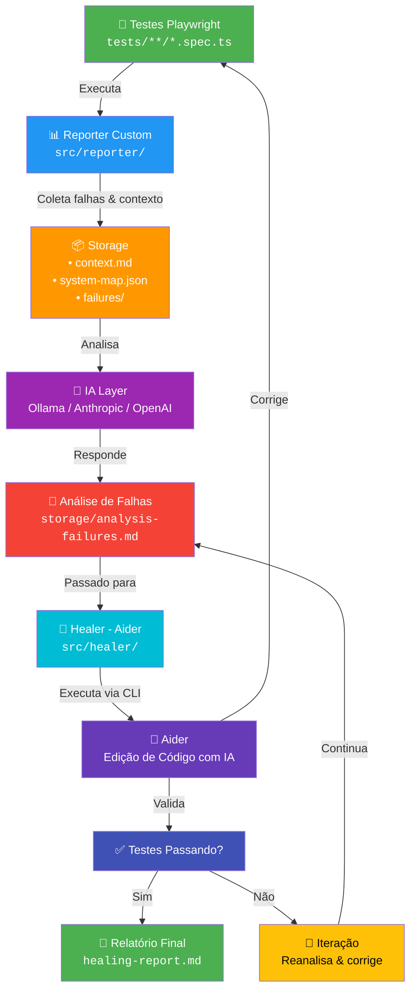

# 🤖 Playwright Intelligence

Ferramenta que intercepta a execução de testes Playwright para coletar contexto de falhas, mapear cobertura do sistema e usar IA local (Ollama) ou nuvem (Anthropic/OpenAI) para analisar padrões, sugerir melhorias e até corrigir testes automaticamente.

**🎯 Sem custos de API (opcional). Roda 100% localmente no seu PC.**

---

## 🏗️ Arquitetura

O sistema é dividido em quatro camadas principais que trabalham em conjunto para transformar falhas de teste em insights e correções:



### Componentes Principais

1.  **Reporter (`src/reporter/`)**: Intercepta a execução do Playwright e coleta dados de screenshots, stack traces e estado do DOM.
2.  **Analyzer (`src/analyzer/`)**: Interface com provedores de IA para processar os dados coletados.
3.  **Healer (`src/healer/`)**: Orquestra a correção automática de testes usando o **Aider**.
4.  **Storage (`storage/`)**: Camada de persistência para contextos de falha, mapas de sistema e relatórios.

---

## 📂 Estrutura do Projeto

```
play-intelligence/
├── src/                              # Código-fonte principal
│   ├── reporter/                     # Reporter Playwright (Collector & Mapper)
│   ├── analyzer/                     # Análise com IA (Clients & Prompts)
│   ├── healer/                       # Correção automática com Aider
│   ├── cli.ts                        # Interface de linha de comando
│   └── config.ts                     # Configuração centralizada
├── storage/                          # Dados gerados (contexto, mapas, reports)
├── tests/                            # Testes de exemplo
├── .github/workflows/                # CI/CD com GitHub Actions
├── docker-compose.yml                # Docker para Ollama
├── setup-ollama.sh                   # Script de setup automatizado
└── playwright.config.ts              # Configuração do Playwright
```

---

## 🚀 Quick Start

### 1. Instalação Automática (Recomendado)

```bash
# 1. Clone o projeto e instale dependências
npm install

# 2. Setup completo (Docker + Ollama + Modelos + Aider)
bash setup-ollama.sh
```

### 2. Configuração do Playwright

Adicione o reporter no seu arquivo `playwright.config.ts`:

```typescript
export default defineConfig({
  reporter: [
    ['list'],
    ['./src/reporter/index.ts'],
  ],
  use: {
    trace: 'on',
    screenshot: 'on',
  }
});
```

### 3. Fluxo de Trabalho

```bash
# Executa testes e coleta contexto
npm run test

# Analisa falhas e identifica padrões
npm run ai:analyze

# (Opcional) Tenta corrigir os testes automaticamente
npm run ai:heal
```

---

## 🛠️ Comandos Disponíveis

| Comando | Descrição |
|---------|-----------|
| `npm run test` | Executa a suite de testes Playwright com coleta de dados. |
| `npm run ai:analyze` | Gera um relatório detalhado sobre padrões de falha e causas raiz. |
| `npm run ai:suggest` | Sugere novos cenários de teste baseados na cobertura atual. |
| `npm run ai:heal` | Inicia o processo de auto-correção usando Aider. |
| `npm run ai:health` | Verifica a conectividade com o provedor de IA. |
| `npm run build` | Compila o projeto TypeScript para JavaScript. |

---

## ⚙️ Configuração (.env)

O projeto é altamente configurável através de variáveis de ambiente:

```env
# Provedor: ollama | anthropic | openai
AI_PROVIDER=ollama
OLLAMA_MODEL=gemma4:e2b
OLLAMA_URL=http://localhost:11434

# Timeouts e Parâmetros
AI_TIMEOUT_MS=900000
AI_TEMPERATURE=0.2

# Healer (Aider)
AIDER_MODEL=ollama_chat/gemma4:e2b
AIDER_AUTO_COMMIT=true
```

---

## 🤖 Modelos Recomendados

Para execução local em máquinas com 16GB RAM (ex: Ryzen 7):
- **gemma4:e2b**: Especializado em análise técnica e código.
- **qwen2.5-coder:7b**: Excelente equilíbrio entre performance e precisão.
- **deepseek-r1:7b**: Ideal para raciocínio lógico complexo.

---

## 🔄 CI/CD - GitHub Actions

O projeto inclui uma integração nativa com GitHub Actions para rodar testes. 

> [!NOTE]
> A Action está configurada para **execução manual** via `workflow_dispatch`. Isso permite que você escolha exatamente quando gastar recursos de IA em nuvem para analisar falhas complexas.

> [!TIP]
> A análise de IA no CI é enviada diretamente para o **Job Summary** do GitHub. O `healer` é desabilitado no CI para economizar recursos.

---

## 📜 Histórico de Mudanças

- **v1.1**: Reorganização total do código para a pasta `src/`.
- **v1.1**: Suporte a "Thinking Mode" no Gemma para análises mais profundas.
- **v1.0**: Integração inicial com Aider para auto-correção.
- **v1.0**: Implementação do `SystemMapper` para visualização de cobertura.

---

## 📞 Suporte e Troubleshooting

- Se o Ollama falhar por timeout, aumente `AI_TIMEOUT_MS`.
- Verifique se o Docker está rodando com `make health`.
- Logs detalhados em `storage/context.md`.
