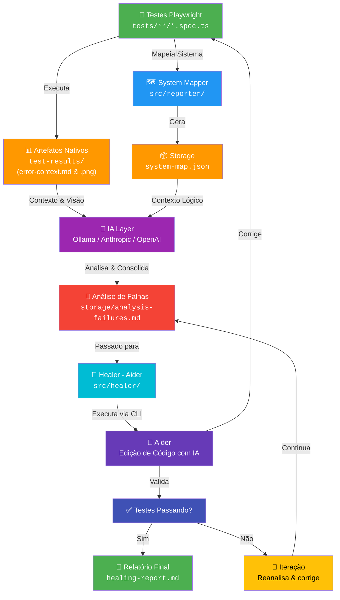

# 🤖 Playwright Intelligence

Ferramenta que analisa execuções de testes Playwright para coletar contexto nativo de falhas, mapear cobertura do sistema e usar IA local (Ollama) ou nuvem (Anthropic/OpenAI) para extrair padrões, analisar visualmente screenshots, sugerir melhorias e até corrigir testes automaticamente.

**🎯 Sem custos de API (opcional). Roda 100% localmente no seu PC.**

---

## 🏗️ Nova Arquitetura (v1.2)

O sistema consome nativamente os artefatos de erro do Playwright, eliminando redundâncias. Ele é dividido em camadas que trabalham em conjunto para transformar falhas em insights:


```mermaid
graph TD
    A["🧪 Testes Playwright<br/><code>tests/**/*.spec.ts</code>"] -->|Executa| B["📊 Artefatos Nativos<br/><code>test-results/</code><br/>(error-context.md & .png)"]
    
    A -->|Mapeia Sistema| C["🗺️ System Mapper<br/><code>src/reporter/</code>"]
    C -->|Gera| D["📦 Storage<br/><code>system-map.json</code>"]
    
    B -->|Contexto & Visão| E["🤖 IA Layer<br/>Ollama / Anthropic / OpenAI"]
    D -->|Contexto Lógico| E
    
    E -->|Analisa & Consolida| F["📝 Análise de Falhas<br/><code>storage/analysis-failures.md</code>"]
    
    F -->|Passado para| G["🏥 Healer - Aider<br/><code>src/healer/</code>"]
    
    G -->|Executa via CLI| H["🤖 Aider<br/>Edição de Código com IA"]
    
    H -->|Corrige| A
    
    H -->|Valida| I["✅ Testes Passando?"]
    
    I -->|Sim| J["📄 Relatório Final<br/><code>healing-report.md</code>"]
    
    I -->|Não| K["🔄 Iteração<br/>Reanalisa & corrige"]
    
    K -->|Continua| F

    style A fill:#4CAF50,color:#fff
    style B fill:#FF9800,color:#fff
    style C fill:#2196F3,color:#fff
    style D fill:#FF9800,color:#fff
    style E fill:#9C27B0,color:#fff
    style F fill:#F44336,color:#fff
    style G fill:#00BCD4,color:#fff
    style H fill:#673AB7,color:#fff
    style I fill:#3F51B5,color:#fff
    style J fill:#4CAF50,color:#fff
    style K fill:#FFC107,color:#000
```

### Componentes Principais

1.  **Test Results Nativos (`test-results/`)**: Aproveita a pasta padrão do Playwright. Cada falha gera um `error-context.md` nativo junto com o screenshot de erro.
2.  **Reporter (`src/reporter/`)**: Reporter inteligente (`SystemMapper`) focado exclusivamente em mapear as rotas, cobertura de testes e gerar o `system-map.json`.
3.  **Analyzer (`src/analyzer/`)**: O CLI (`ai:analyze`) faz a varredura das falhas na pasta `test-results`, processa as imagens localmente adicionando logs de Visão Computacional aos contextos e consolida a causa raiz usando modelos LLM/VLM.
4.  **Healer (`src/healer/`)**: Orquestra a correção automática de testes usando o **Aider** a partir das análises levantadas.

---

## 📂 Estrutura do Projeto

```
play-intelligence/
├── src/                              # Código-fonte principal
│   ├── reporter/                     # Reporter Playwright (SystemMapper)
│   ├── analyzer/                     # Análise com IA (Clients & Prompts)
│   ├── healer/                       # Correção automática com Aider
│   ├── cli.ts                        # Interface de linha de comando principal
│   └── config.ts                     # Configuração centralizada
├── storage/                          # Dados estáticos persistentes (mapas, reports finais)
├── test-results/                     # Contexto de erros nativo e screenshots
├── tests/                            # Testes de exemplo
├── .github/workflows/                # CI/CD com GitHub Actions
├── docker-compose.yml                # Docker para Ollama (Otimizado para CPU/GPU)
├── setup-ollama.sh                   # Script de setup automatizado
└── playwright.config.ts              # Configuração do Playwright
```

---

## 🚀 Quick Start

### 1. Instalação Automática (Recomendado)

```bash
# 1. Clone o projeto e instale dependências
npm install

# 2. Setup completo (Docker + Ollama + Modelos + Aider)
bash setup-ollama.sh
```

### 2. Configuração do Playwright

Certifique-se de que o seu `playwright.config.ts` captura screenshots em falhas e mantém o nosso SystemMapper configurado:

```typescript
export default defineConfig({
  reporter: [
    ['list'],
    ['./src/reporter/index.ts'], // SystemMapper
  ],
  use: {
    trace: 'on',
    screenshot: 'on', // Essencial para a IA de Visão
  }
});
```

### 3. Fluxo de Trabalho

```bash
# Executa testes (as falhas vão para test-results/)
npm run test

# Analisa falhas (Visão Computacional nos prints + Análise Causa Raiz)
npm run ai:analyze

# (Opcional) Tenta corrigir os testes automaticamente com Aider
npm run ai:heal
```

---

## 🛠️ Comandos Disponíveis

| Comando | Descrição |
|---------|-----------|
| `npm run test` | Executa a suite Playwright e gera o contexto de erro/screenshots. |
| `npm run ai:analyze` | Injeta Análise Visual e gera um relatório sobre causas raiz. |
| `npm run ai:suggest` | Sugere novos cenários de teste baseados na cobertura do `system-map`. |
| `npm run ai:heal` | Inicia o processo de auto-correção usando o Aider. |
| `npm run ai:health` | Verifica a conectividade com o provedor de IA. |
| `npm run build` | Compila o projeto TypeScript para JavaScript. |

---

## ⚙️ Configuração (.env)

Configure o comportamento do ambiente no seu `.env`:

```env
# Provedor: ollama | anthropic | openai
AI_PROVIDER=ollama
OLLAMA_MODEL=llama3.2-vision # Modelo multimodal recomendado
OLLAMA_URL=http://localhost:11434

# Diretórios
TEST_RESULTS_DIR=./test-results

# Timeouts e Parâmetros
AI_TIMEOUT_MS=900000
AI_TEMPERATURE=0.2

# Healer (Aider)
AIDER_MODEL=ollama_chat/gemma4:e2b
AIDER_AUTO_COMMIT=true
```

---

## 🤖 Modelos Recomendados (Ollama)

O `docker-compose.yml` está ajustado com limitação de threads de CPU para evitar travamentos de sistema. Se enfrentar alucinações severas com aceleração gráfica (Vulkan), recomendamos desabilitar o Vulkan e utilizar computação direta por CPU.

- **llama3.2-vision** / **llava**: Obrigatório para Análise Visual (Visão Computacional das falhas). Suportam a passagem da imagem em base64 corretamente.
- **gemma4:e2b** / **qwen2.5-coder:7b**: Especializados em análise técnica de código, ótimos para a auto-correção do `healer`.
- **deepseek-r1:7b**: Ideal para fluxos complexos de diagnóstico de testes (reasoning model).

---

## 🔄 CI/CD - GitHub Actions

O projeto inclui uma integração nativa com GitHub Actions para rodar testes. 

> [!NOTE]
> A Action está configurada para **execução manual** via `workflow_dispatch`. Isso permite que você escolha exatamente quando gastar recursos de IA em nuvem para analisar falhas complexas.

> [!TIP]
> A análise de IA no CI é enviada diretamente para o **Job Summary** do GitHub. O `healer` é desabilitado no CI para economizar recursos.

---

## 📜 Histórico de Mudanças

- **v1.2**: Migração para a arquitetura nativa do Playwright (`test-results/`), removendo o `FailureCollector` e integrando suporte a modelos Visuais (`llama3.2-vision`).
- **v1.1**: Reorganização total do código para a pasta `src/` e suporte a "Thinking Mode" no Gemma para análises mais profundas.
- **v1.0**: Integração inicial com Aider para auto-correção e `SystemMapper` para visualização de cobertura.

---

## 📞 Suporte e Troubleshooting

- **A IA está inventando contexto na imagem?**: Verifique se o modelo suporta visão (`llama3.2-vision` ou `llava`) e considere desabilitar o `OLLAMA_VULKAN=1` no Docker Compose se estiver usando placas AMD, pois a corrupção do tensor no Vulkan gera alucinações.
- **Timeout no Ollama**: Aumente a variável `AI_TIMEOUT_MS`. Se rodar por CPU, as respostas podem demorar vários minutos.
- **Onde encontro o log dos erros?**: Todas as descrições de falhas de teste (e as análises de visão da IA) ficam injetadas diretamente na pasta de falhas nativa: `test-results/nome-do-teste/error-context.md`.
